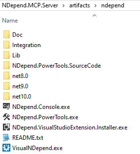
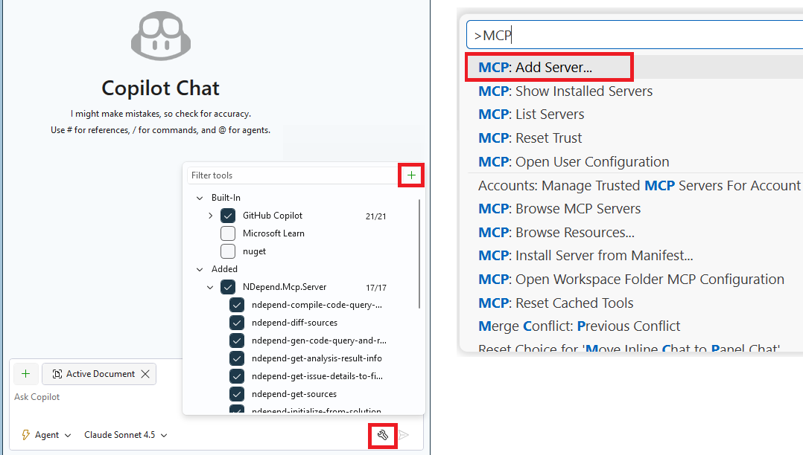

   
# NDepend.MCP.Server  

The **NDepend.MCP.Server** is a Model Context Protocol (MCP) server that delivers deep workspace analysis and advanced code inspection capabilities for .NET projects, powered by the NDepend API.

Its key strengths are speed, rich semantic knowledge of the codebase and the ability to efficiently analyze and query large .NET solutions while keeping LLM token usage reasonable. It gives the AI agent access to Roslyn Analyzers, ReSharper Code Inspections, and NDepend’s rules, along with objective code metrics such as maintainability, complexity and coverage, diff from a baseline, and dependency analysis features.

**Privacy:** While information like issues, metrics, dependencies, and identifiers is shared with the AI agent, your source code never leaves your environment—**NDepend scan runs entirely on-premises**. The LLM only accesses source code when you explicitly ask it to fix an issue.

Since the project is open source, you’re free to adapt and extend the server with MCP tools that fit your workflow.

## Features

- **Workspace Overview** - Get high-level information and statistics about your .NET workspace.
- **Source Code Analysis** - Analyze C# source files, quality, and project structure.
- **Dependency Tracking** - Explore project dependencies and generate SVG diagrams of your code.
- **Issues List** - Identify code issues from NDepend rules, Roslyn Analyzers, and ReSharper Code Inspections.
- **Issues Fix** - Provide rich issue data to guide Copilot and the LLM in suggesting proper fixes (suport complex issue fix involving  multiple source files).
- **Generate Web Report** - Generate a full NDepend web report and open it in the browser. See sample reports here: https://www.ndepend.com/sample-reports/
- **Generate CQLinq Query and Rule** - Guide the LLM in creating custom code queries or rules based on your requirements.
- **Answer Complex Request About Your Code** - Based on the user request, generate and execute complex queries on-the-fly to inspect: 
  - Source code files
  - Code quality (lines of code, comment, complexity, maintainability index, code coverage)
  - Code dependencies (usage, coupling, cohesion, Clean Architecture)
  - Object Oriented usage (inheritance, interface, encapsulation, instantiation, SOLID principles)
  - Naming of code elements
  - State mutability (fields, properties, events)
  - Changes since a baseline
  - Issues, rules or quality gates status
  
## Build

- First get the NDepend zipped redistributable from: https://www.ndepend.com/download

- Unzip it in **%your-dir%\NDepend.MCP.Server\artifacts\artifacts\ndepend**

   

- **REQUIRED:** Run **VisualNDepend.exe** once to start your evaluation or register a license.

- Then rebuild the solution **%your-dir%\NDepend.MCP.Server\NDepend.Mcp.Server.sln**

- DLLs and executables built can be found here:
```
%your-dir%\NDepend.MCP.Server\artifacts\bin\NDepend.Mcp.StdioServer\Debug\net10.0\NDepend.Mcp.StdioServer.exe
```
```
%your-dir%\NDepend.MCP.Server\artifacts\bin\NDepend.Mcp.SseServer\Debug\net10.0\NDepend.Mcp.SseServer.exe
```

## MCP Server Registration

You can register the NDepend MCP Server from Visual Studio or VSCode this way.

 

This will add to the MCP JSON configuration file (for stdio):

```json
{
  "inputs": [],
  "servers": {
    "NDepend.Mcp.Server": {
      "type": "stdio",
      "command": "%your-dir%\\NDepend.MCP.Server\\artifacts\\bin\\NDepend.Mcp.StdioServer\\Debug\\net8.0\\NDepend.Mcp.StdioServer.exe",
      "env": {}
    }
  }
}
```

or for HTTP SSE

```json
{
  "inputs": [],
  "servers": {
    "NDepend.Mcp.Server": {
      "url": "http://localhost:3001/sse",
      "type": "sse"
    }
  }
}
```

Github Copilot MCP configuration file for Visual Studio 2026 or VSCode can be found here:
```
C:\Users\%usr%\AppData\Roaming\Code\User\mcp.json - Global configuration for all solutions
[SOLUTIONDIR]\.vs\mcp.json - Visual Studio only, solution-specific, user-specific
[SOLUTIONDIR]\.mcp.json - Solution-level, can be tracked in source control
[SOLUTIONDIR]\.vscode\mcp.json - Supports both VS Code and Visual Studio
```

Note that if the same MCP server is listed in both a global configuration file and a solution-specific configuration file, Copilot treats them as separate servers, which can cause conflicts.

## Logs

- If an error occurs while using an NDepend MCP tool, check the log files located at:

```
%your-dir%\NDepend.MCP.Server\artifacts\logs
```

## Usage

Once configured, you can ask questions like:

- Initialize + Run Analysis + Web Report:
```
run ndepend analysis
give me analysis details
build an ndepend web report
```

- Code query or rule generation to answer a complex request:
```
list pairs of class that uses each other
which ctor that register to some events in a non disposable class
check for the SOLID open close principle
list methods that are both poorly maintainable and insufficiently tested
find Clean Architecture violations
```

 

- Dependencies:
```
which callers and callees for this class
show a call graph of this method
```
 


- Issue list & fix:
```
which new issue in files named like Period
fix the first one
which code sprawl related issues
```

 

- Metrics:
```
which complex method poorly covered by tests
list less maintainable methods
```

- Quality Gates:
```
which quality gate fail
which quality gate got fixed since the baseline
```

- Rules:
```
which Roslyn Analyzer fail?
which ndepend rule fail with more than 5 issues
```

- Code Search:
```
which class is related to Authentification
```

- Source Files:
```
which source file changed since the baseline
describe changes in the third one
show diff for the 5 last
```

## Exposed Tools

### Initialization Tools

- `ndepend-initialize-from-solution`: Initialize the NDepend analysis session with a .NET solution file. If an NDepend project (.ndproj file) is attached to the solution, use it. Else create an NDepend project side-by-side with the solution and analyze it.
  
  Use when:
  - **REQUIRED FIRST STEP** before using any other NDepend MCP tool
  - Switching to a different solution

### Analysis Tools

- `ndepend-run-analysis`: Run the NDepend analysis on the initialized workspace and update all session data (dependencies, issues, metrics, etc...).

  Use when:
  - User explicitly requests: "run analysis", "analyze the code", "refresh results"
  - Post-fix verification: "I fixed the issues, check again"
  - After code changes or recompilation

- `ndepend-run-analysis-build-report`: Run the NDepend analysis, update all session data, and build a web report, open it in the browser.

  Use when:
  - User requests: "show me a web report", "generate HTML report", "visualize the analysis"
  - User wants interactive exploration
  - User asks for visual/graphical outputs

- `ndepend-get-analysis-result-info`: Retrieve metadata about current and baseline analysis results in the session.

  Use when:
  - User asks: "when was the analysis run?", "what project is being analyzed?"
  - User wants baseline information
  - Debugging or verification scenarios

### Search & Discovery Tools

- `ndepend-search-code-elements`: Search and discover code elements across the codebase.

    Use when:
  - Discovery & Navigation: "Which classes are related to authentication?"
  - Pattern & Convention: "Which classes follow the *Manager pattern?"
  - File-Based: "What's in the UserService.cs file?"
  - Change Tracking: "Which methods were added since the baseline?"

**All tools that query the codebase like `ndepend-search-code-elements` include a *currentOrBaseline* flag, which lets you run the tool against either the current analysis results or the baseline.**

### Code Metrics Tools

- `ndepend-search-code-metrics`: Collect and analyze code metrics for quality assessment.

  Use when:
  - Refactoring Candidates: "Which code is poorly maintainable?"
  - Quality Assessment: "How complex is the UserService class?"
  - Test Coverage Analysis: "Which methods need more tests?"
  - Size & Complexity: "How many lines of code in this class?"
  - Comparison & Prioritization: "Compare metrics across services"

### Dependency Analysis Tools

- `ndepend-list-dependencies`: Collect and present dependencies for code elements with comprehensive context. Also generate a HTML SVG diagram of the required dependency.

  Use when:
  - Understanding Usage (Callers): "What calls this method?"
  - Understanding Dependencies (Callees): "What does this method call?"
  - Impact Analysis: "If I change this method, what breaks?"
  - Call Chain Exploration: "Show me the full call chain"
  - Refactoring Planning: "Can I safely delete this method?"
  - Architectural Analysis: "Does the UI layer call the database directly?"
  - Debugging & Troubleshooting: "How is this method being invoked?"
  - Code Review: "What's affected by this new method?"

### Issue Management Tools

- `ndepend-list-issues`: List issues scoped by user's request with comprehensive details.

  Use when:
  - Code Quality & Review: "List issues in this source file"
  - Technical Debt Management: "Show me all technical debt items"
  - Compliance & Standards: "List all coding standard violations"
  - Reporting & Analytics: "Generate a report of all issues by severity"

- `ndepend-get-issue-details-to-fix-it`: Retrieve comprehensive diagnostic information for a specific issue.

  Use when:
  - User asks: "How do I fix issue #X?"
  - User requests detailed information about an issue
  - User wants want the Copilot to fix the issue

### Rule Management Tools

- `ndepend-list-all-rules-summary`: Return hierarchical categorized summary of all rules in the current project, with each the number of issues found.

  Use when:
  - Discover available rules before calling `ndepend-list-rules-detailed` or `ndepend-list-issues`
  - Identify valid values for `filterRuleCategories` and `filterRuleIds` before calling `ndepend-list-rules-detailed` or `ndepend-list-issues` 
  - Audit and governance

- `ndepend-list-rules-detailed`: Return paginated list of rules with descriptions and fix guidance.

  Use when:
  - Understanding what a specific rule checks
  - Learning how to fix violations
  - Exploring rule documentation
  - After calling `ndepend-list-all-rules-summary` to get detailed info

### Quality Gate Tools

- `ndepend-list-quality-gates-status`: Return status of each quality gate to assess code quality standards.

  Use when:
  - Status Checks: "Did the code pass quality gates?"
  - Failure Investigation: "Which quality gates are failing?"
  - Specific Gate Queries: "Did we pass the test coverage gate?"
  - Pre-Merge Validation: "Can I merge this PR?"
  - Threshold Details: "What are the quality gate thresholds?"
  - Comparison & Trends: "How does this compare to the baseline?"
  - Team Standards: "What quality gates do we have?"
  - Debugging Build Issues: "Why is the build blocked?"

### Source Code Tools

- `ndepend-get-sources`: Retrieve source code as raw text from NDepend.

  Use when:
  - Viewing Code: "Show me the code for UserService.Authenticate"
  - Understanding Implementation: "How is this method implemented?"
  - Code Review: "Review the code for this method"
  - Debugging & Troubleshooting: "Show me where the error occurs"
  - Learning & Examples: "Show me an example of dependency injection"
  - Refactoring Analysis: "Show me the code before I refactor it"
  - Following Up on Other Tools: "Show me the code with low maintainability"

### Code Query Tools

- `ndepend-gen-code-query-and-rule`: Provide prompts to the LLM to make it an expert in code queries and rule generation. The LLM first identifies the code querying features it needs based on the user’s request, then it calls this tool to obtain a prompt for each feature choosen.

  Use when:
  - **ALWAYS** when user requests an NDepend code query or code rule
  - Complex codebase analysis that can't be handled by other tools

  Available code query kind prompts:
  - `code-query-list`: Returns collection of code elements with properties
  - `code-rule`: Quality rule identifying violations
  - `quality-gate`: Quality criterion with WARN/FAIL thresholds
  - `querying-issue-rule`: Selects issues and rules
  - `trend-metric`: Scalar value stored over time to plot chart
  - `code-query-scalar`: Returns single numeric value

  Available features prompts:
  - `code-query-essential` (ALWAYS REQUIRED)
  - `line-of-code`, `maintainability`, `complexity`, `coverage`, `comment`
  - `usage-dependency`, `parent-children-relationship`, `inheritance-and-base-class`, `interface`
  - `solid-principles`, `clean-architecture`, `encapsulation-and-visibility`, `state-mutability`
  - `diff-since-baseline`, `naming`, `attribute`, `source-file-declaration`
  - `event-pattern`, `constructor-instantiation`

- `ndepend-compile-code-query-or-rule`: Validate code queries/rules for syntax errors and compilation issues. Returns compilation errors if any, to let a chance to the LLM to fix them.

  Use when:
  - **ALWAYS** after `ndepend-gen-code-query-and-rule` to validate the generated code query or rule

- `ndepend-run-code-query-or-rule`: Compile and execute code query or rule against the session's analysis result and baseline.

  Use when:
  - After generating and compiling a query
  - User requests execution
  - Complex codebase analysis requiring custom queries- 

## Requirements

- .NET 10.0 or higher
- ModelContextProtocol NuGet package
- NDepend version 2026.1.3 or upper redistributable (evaluation or license)

   ### Note

   This project is open source, but it relies on the NDepend.API, which requires a separate license (either a free evaluation or a paid license) to use.
   - Evaluation: https://www.ndepend.com/download
   - License: https://www.ndepend.com/purchase

## Contributing

Contributions are welcome! Please feel free to submit pull requests or open issues.

## License

This project is open source under the MIT License. 
It depends on the proprietary NDepend.API (https://www.ndepend.com/) which must be obtained separately (evaluation or license).
No rights to the NDepend API are granted by this project.